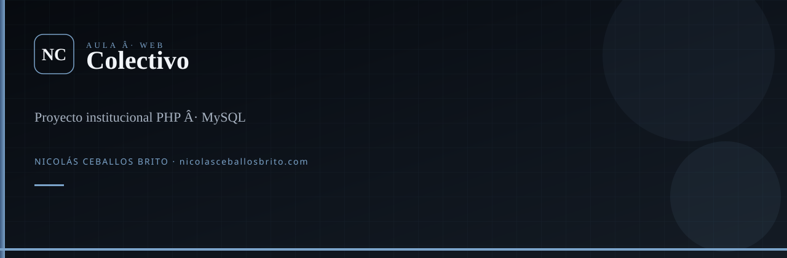

<div align="center">
  
</div>

<br />

<div align="center">

**Trabajo de programación** (UCP): app PHP + MySQL con login y módulos de aula. No es un producto en producción.

[](https://www.php.net/)
[](https://www.mysql.com/)

</div>

## Qué es

Proyecto colectivo de la asignatura de **programación**: autenticación, dashboard y vistas. Esquema en `colectivo.sql`. Carpetas `controlador/`, `modelo/`, `vista/`. Trabajo en grupo (créditos en el código y fotos del equipo).

## Ver local

```bash
git clone https://github.com/Nico2603/Colectivo.git
```

Sirve con PHP + MySQL (XAMPP o similar). Importa `colectivo.sql` y ajusta la conexión. El README viejo apuntaba a `localhost/php/Colectivo/`.

## Agentes

`.agents/skills/` — Superpowers, `nicolas-identity`, `find-skills`. `graphify update .`

---

<div align="center">

**Nicolás Ceballos Brito** · Ingeniero en Sistemas y Telecomunicaciones (UCP 2025)  
CTO · Prosavis · Pereira, Colombia

[nicolasceballosbrito.com](https://nicolasceballosbrito.com)
·
[GitHub](https://github.com/Nico2603)
·
[LinkedIn](https://www.linkedin.com/in/nicolas-ceballos-brito/)
·
[X](https://x.com/NicolasCBrito)
·
[Instagram](https://www.instagram.com/nico_ceballos26/)
·
[Hugging Face](https://huggingface.co/Flackoooo)
·
[Email](mailto:nicolasceballosbrito@gmail.com)

</div>
